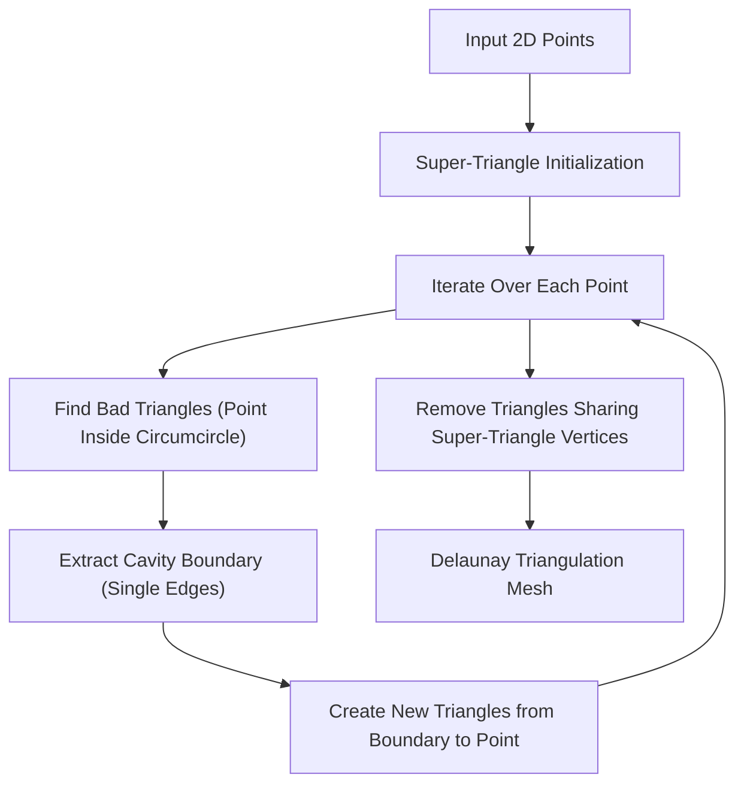

# genpark-delaunay-triangulation-bowyer-watson-skill

Agent Skill implementing the **Bowyer-Watson incremental Delaunay Triangulation algorithm** in 2D space, ensuring empty circumcircles for planar graph triangulation.

## Architectural Overview

```mermaid
flowchart TD
    Points["Input 2D Points"] --> Super["Super-Triangle Initialization"]
    Super --> Loop["Iterate Over Each Point"]
    Loop --> Circum["Find Bad Triangles (Point Inside Circumcircle)"]
    Circum --> Boundary["Extract Cavity Boundary (Single Edges)"]
    Boundary --> Retriangulate["Create New Triangles from Boundary to Point"]
    Retriangulate --> Loop
    Loop --> Clean["Remove Triangles Sharing Super-Triangle Vertices"]
    Clean --> Output["Delaunay Triangulation Mesh"]
```
